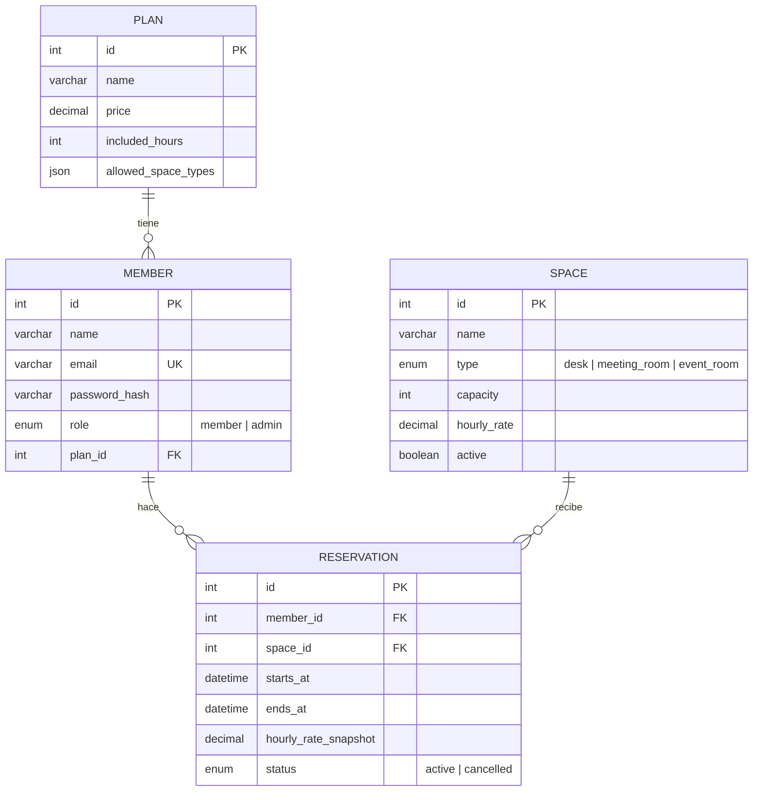

# Diagrama EER — CoWork Hub

## Decisiones de modelado

- **Normalización (3FN)**: `Plan`, `Member`, `Space` y `Reservation` están separados
  porque cada uno tiene su propio ciclo de vida y sus propios atributos; no hay
  redundancia de datos entre ellos.
- **`hourly_rate_snapshot` en `Reservation`** es la única excepción intencional
  a la normalización estricta: guarda la tarifa vigente al momento de reservar.
  Es necesario para que la facturación "cuadre al centavo" con lo realmente
  reservado, incluso si el precio del espacio cambia después. Sin este campo,
  recalcular facturas antiguas con una tarifa nueva rompería la regla de negocio
  más explícita del enunciado.
- **`allowed_space_types` en `Plan` como JSON`**: es un atributo multivaluado
  simple (lista de tipos de espacio) que no necesita su propia tabla ni
  consultas relacionales complejas; modelarlo como tabla intermedia habría
  añadido un join sin beneficio real para este caso de uso.
- **Claves foráneas con integridad referencial**: `Member.plan_id → Plan.id`,
  `Reservation.member_id → Member.id`, `Reservation.space_id → Space.id`.
  Esto es lo que impide, a nivel de motor, facturar una reserva que no existe
  o reservar a nombre de un miembro inexistente.
- **Índices**:
  - `reservations(space_id, starts_at, ends_at)` — acelera la detección de
    solapamientos y los reportes filtrados por espacio + rango de fechas.
  - `reservations(member_id, starts_at)` — acelera "mis reservas" y el reporte
    de consumo mensual por miembro.
  - `members(email)` único — login rápido y refuerza la regla de un correo
    por cuenta.
- **Regla "todo o nada"**: crear una reserva corre dentro de una transacción
  de MySQL con `SELECT ... FOR UPDATE` sobre las reservas del mismo espacio,
  así que la verificación de solapamiento y la inserción son atómicas: dos
  peticiones simultáneas para el mismo hueco nunca pueden pasar ambas.
